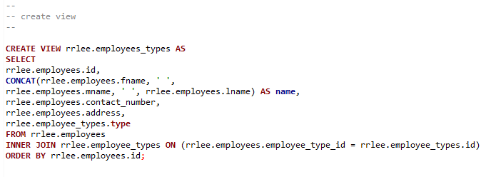
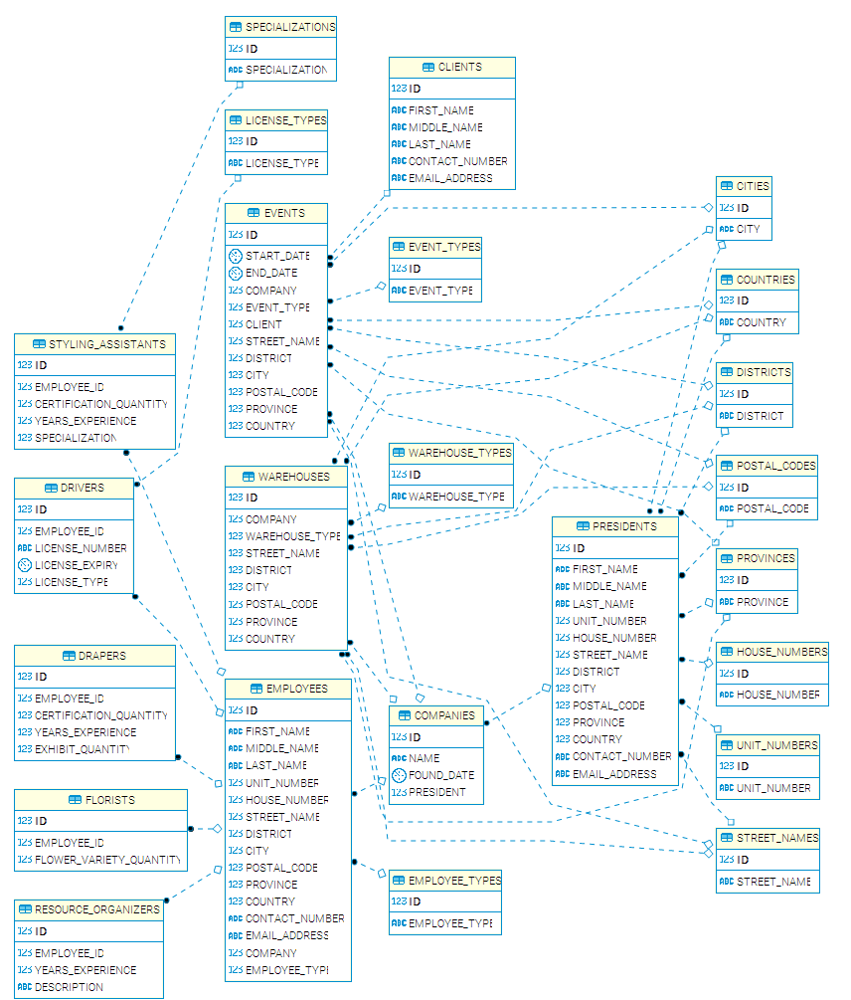

Ronn Angelo Lee 
BS Information Technology  
Database Management 2  
  
# Contents
- [Create View Query](#create-view-query)
- [View Result Table](#view-result-table)
- [Employees](#employees)
- [Employee Types](#employee_types)
- [Entity Relationship Diagram](#er-diagram)
  
<h1 id="create-view-query">Create View Query</h1>
<table>
    <tr width="100%">
        <th width="50%">Screenshot</th>
        <th width="50%"><a href="view.sql" target="_blank">Query</a></th>
    </tr>
    <tr idth="100%">
        <td width="50%"></td>
        <td width="50%">

~~~sql
CREATE VIEW rrlee.employees_types AS
SELECT
rrlee.employees.id,
CONCAT(rrlee.employees.fname, ' ',
rrlee.employees.mname, ' ', rrlee.employees.lname) AS name,
rrlee.employees.contact_number,
rrlee.employees.address,
rrlee.employee_types.type
FROM rrlee.employees
INNER JOIN rrlee.employee_types
ON (rrlee.employees.employee_type_id = rrlee.employee_types.id)
ORDER BY rrlee.employees.id;
~~~

</table>

<h1 id="view-result-table">View Result Table</h1>

<h1 id="employees">Employees</h1>

<h1 id="employee_types">Employee Types</h1>

<h1 id="er-diagram">Entity Relationship Diagram</h1>

