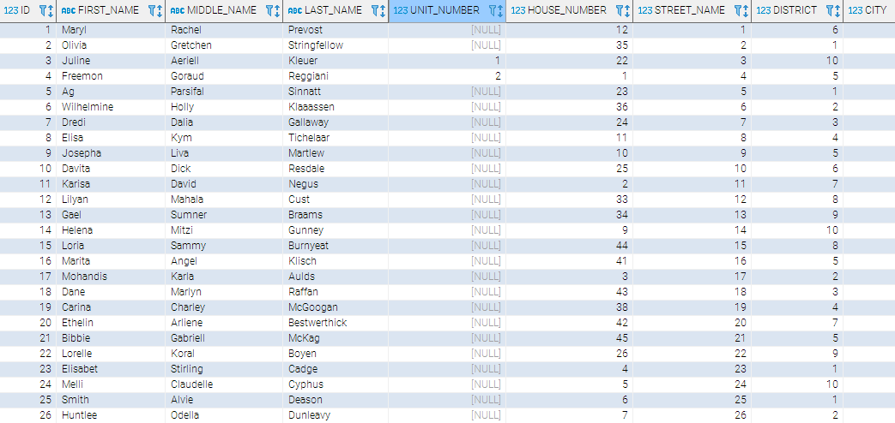
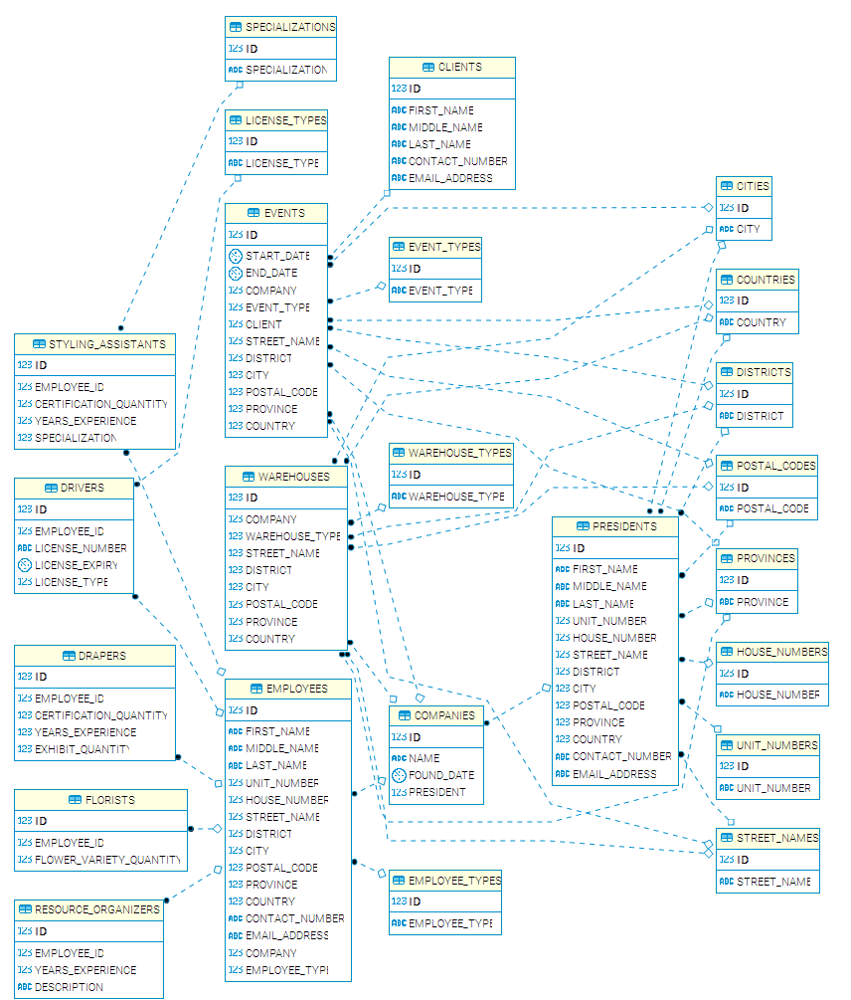

<h1 id="projects-3-oracle">Projects 3 Oracle</h1>

Ronn Angelo Lee  
BS Information Technology - MI 182

# Contents

- [Table DDL](#table-ddl)
- [View](#view)
    - [Query Screenshot](#query-screenshot)
    - [Query in Text](#query-in-text)
- [Employees](#employees)
- [Employee Types](#employee-types)
- [Entity Relationship Diagram](#entity-relationship-diagram)

<h1 id="table-ddl">Table DDL</h1>

<table width="100%">
    <tr width="100%">
        <td>Cities</td>
        <td></td>
    </tr>
    <tr width="100%">
        <td>Clients</td>
        <td></td>
    </tr>
    <tr width="100%">
        <td>Companies</td>
        <td></td>
    </tr>
    <tr width="100%">
        <td>Countries</td>
        <td></td>
    </tr>
    <tr width="100%">
        <td>Districts</td>
        <td></td>
    </tr>
    <tr width="100%">
        <td>Drapers</td>
        <td></td>
    </tr>
    <tr width="100%">
        <td>Drivers</td>
        <td></td>
    </tr>
    <tr width="100%">
        <td>Employee Types</td>
        <td></td>
    </tr>
    <tr width="100%">
        <td>Employees</td>
        <td></td>
    </tr>
    <tr width="100%">
        <td>Event Types</td>
        <td></td>
    </tr>
    <tr width="100%">
        <td>Events</td>
        <td></td>
    </tr>
    <tr width="100%">
        <td>Florists</td>
        <td></td>
    </tr>
    <tr width="100%">
        <td>House Numbers</td>
        <td></td>
    </tr>
    <tr width="100%">
        <td>License Types</td>
        <td></td>
    </tr>
    <tr width="100%">
        <td>Postal Codes</td>
        <td></td>
    </tr>
    <tr width="100%">
        <td>Presidents</td>
        <td></td>
    </tr>
    <tr width="100%">
        <td>Provinces</td>
        <td></td>
    </tr>
    <tr width="100%">
        <td>Resource Organizers</td>
        <td></td>
    </tr>
    <tr width="100%">
        <td>Specializations</td>
        <td></td>
    </tr>
    <tr width="100%">
        <td>Street Names</td>
        <td></td>
    </tr>
    <tr width="100%">
        <td>Styling Assistants</td>
        <td></td>
    </tr>
    <tr width="100%">
        <td>Unit Numbers</td>
        <td></td>
    </tr>
    <tr width="100%">
        <td>Warehouse Types</td>
        <td></td>
    </tr>
    <tr width="100%">
        <td>Warehouses</td>
        <td></td>
    </tr>
</table>

[Go to top](#projects-3-oracle)

<h1 id="view">View</h1>

<table>
    <tr width="100%">
        <th id="query-screenshot">Query Screenshot</th>
        <th id="query-in-text">Query in Text</th>
    </tr>
    <tr width="100%">
        <td></td>
        <td><a href="views/view.sql" target="_blank">

~~~sql
CREATE VIEW
    MI182_RRLEE.employees_types
AS SELECT
    MI182_RRLEE.employees.id,
    CONCAT(
        CONCAT(
            CONCAT(MI182_RRLEE.employees.first_name, ' '),
            CONCAT(MI182_RRLEE.employees.middle_name, ' ')
        ), MI182_RRLEE.employees.last_name)
    AS
        name,
    MI182_RRLEE.employees.contact_number,
    MI182_RRLEE.employee_types.employee_type
FROM
    MI182_RRLEE.employees
INNER JOIN
    MI182_RRLEE.employee_types
ON
    MI182_RRLEE.employees.employee_type = MI182_RRLEE.employee_types.id
ORDER BY
    MI182_RRLEE.employees.id;
~~~

</a></td>
</tr>
</table>

[Go to top](#projects-3-oracle)

<h1 id="employees">Employees</h1>

[Go to top](#projects-3-oracle)

<h1 id="employee-types">Employee Types</h1>

[Go to top](#projects-3-oracle)

<h1 id="entity-relationship-diagram">Entity Relationship Diagram</h1>

[Go to top](#projects-3-oracle)