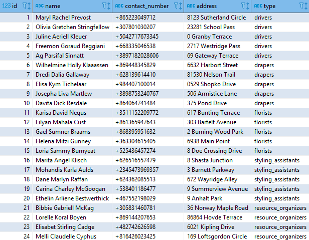
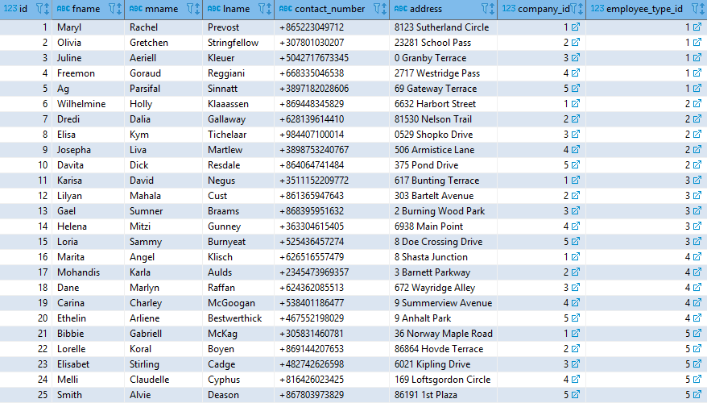
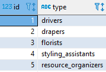

# Projects 3 : PostgreSQL View

Ronn Angelo Lee  
BS Information Technology - MI 182  

# Contents

- [View](#view)
    - [Create View Query](#create-view-query)
    - [View Table](#view-table)
- [Employees Table](#employees-table)
- [Employee Types Table](#employee-types-table)

<h1 id="view">View</h1>
    <table>
        <tr width="100%">
            <th id="view-table" width="50%"><a href="screenshots/view-table.png" target="_blank">View Table</a></th>
            <th id="create-view-query" width="50%"><a href="view.sql" target="_blank">Create View Query</a></th>
        </tr>
        <tr idth="100%">
            <td width="50%"></td>
            <td width="50%">

~~~sql
CREATE VIEW rrlee.employees_types AS
SELECT
rrlee.employees.id,
CONCAT(rrlee.employees.fname, ' ',
rrlee.employees.mname, ' ', rrlee.employees.lname) AS name,
rrlee.employees.contact_number,
rrlee.employees.address,
rrlee.employee_types.type
FROM rrlee.employees
INNER JOIN rrlee.employee_types ON
(rrlee.employees.employee_type_id = rrlee.employee_types.id)
ORDER BY rrlee.employees.id;
~~~

</tr>
</table>

<h1 id="employees-table">Employees Table</h1>

<h1 id="employee-types-table">Employee Types Table</h1>
